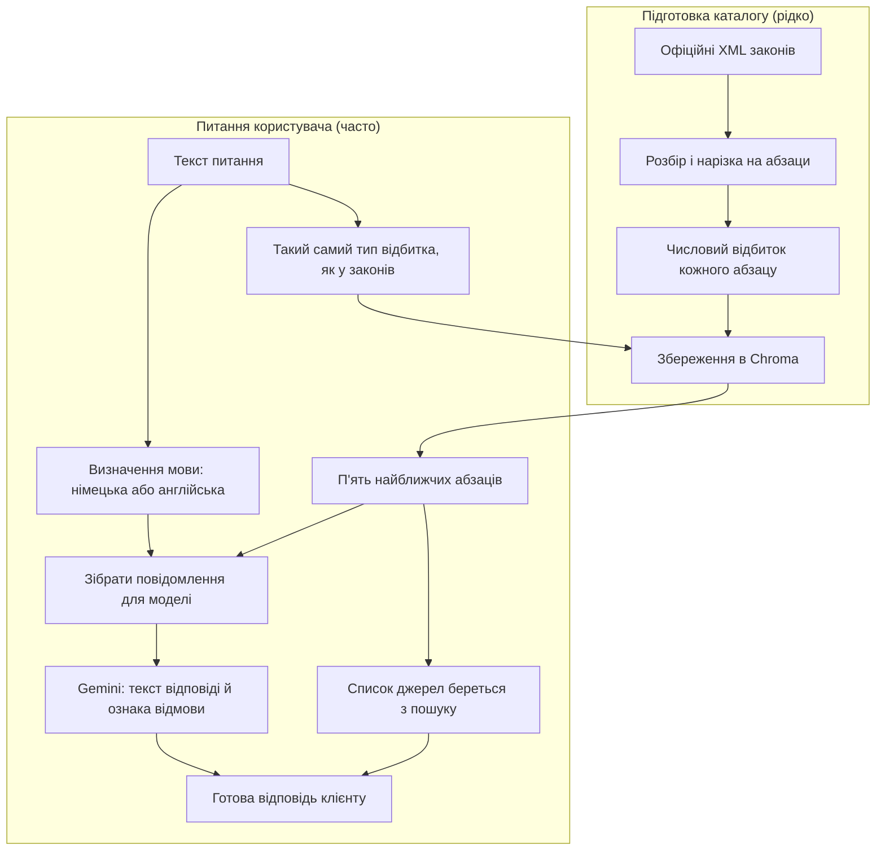
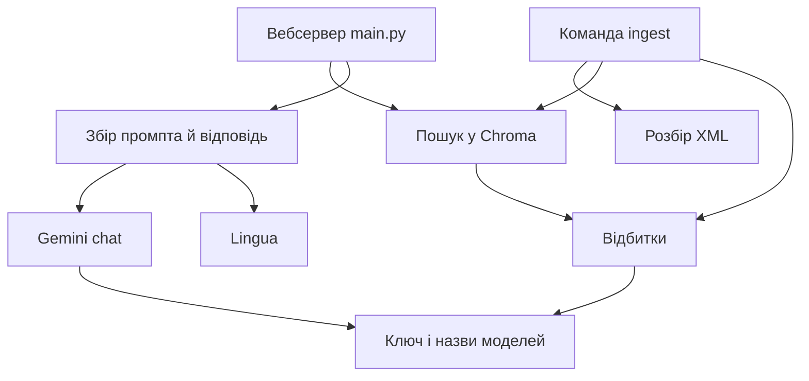

# Структура проєкту та принципові рішення

Цей документ описує, з чого складається цей застосунок, як його частини працюють разом і чому обрано саме такі інструменти. Текст написаний так, щоб його можна було читати без попереднього досвіду в машинному навчанні. Там, де з'являється технічне слово, спочатку дається просте пояснення, а вже потім показано, як це виглядає в цьому репозиторії.

Важливе обмеження продукту: програма не дає юридичної консультації і не замінює адвоката. Вона шукає уривки в заздалегідь завантажених текстах федеральних законів Німеччини про трудове право і на їхній основі формулює відповідь. Якщо в цих текстах немає потрібної інформації, програма повинна сказати, що відповіді в завантажених документах немає. Вигадувати норму їй заборонено.

Мова інтерфейсу й публічного `README.md` - німецька, бо корпус законів німецький. Коментарі в коді, повідомлення в терміналі й назви тестів написані англійською. Цей файл написаний українською.

## Яку задачу розв'язує програма

У законів багато сторінок. Якщо скопіювати всі дванадцять законів у одне повідомлення до мовної моделі (такої як Gemini), виникнуть дві проблеми. По-перше, у моделі є обмеження на довжину вхідного тексту: увесь корпус може просто не поміститися. По-друге, навіть якщо текст поміститься, модель легше змішує різні статті й вигадує цифри, яких у тексті немає.

Тому тут використано підхід, який називають **RAG** (retrieval-augmented generation, тобто «спочатку знайти, потім генерувати»). Ідея схожа на роботу з паперовою картотекою:

1. Заздалегідь розкласти закони на невеликі картки (у нас це абзаци статей).
2. Коли користувач ставить питання, знайти кілька карток, які **за змістом найближчі** до питання.
3. Показати мовній моделі лише ці картки й саме питання.
4. Попросити модель відповісти **тільки** з цього матеріалу й позначити, чи матеріалу вистачило.

Мовна модель тут не «знає закони з голови» в юридичному сенсі. Вона бачить лише ті уривки, які їй підклала програма. Список джерел на екрані теж формує етап пошуку карток, а не модель.

Програма навмисно вузька. Немає облікових записів, історії листування, пошуку в інтернеті й автономних «агентів», які самі вирішують, які сайти відкрити. Є фіксований набір із дванадцяти законів, локальний каталог карток і один спосіб поставити питання: через вебсторінку або через програмний запит.

Обмеження, які реально формували рішення:

- тримати систему простою: один сервіс, одна HTML-сторінка, один фіксований корпус;
- користуватися лише безкоштовною квотою Gemini, без окремого платного рахунку;
- не зберігати персональні дані й не підмішувати сторонні корпоративні документи;
- не давати моделі права виходити за межі завантажених законів.

## Два режими роботи: підготовка карток і відповідь на питання

Система живе двома різними процесами. Їх легко сплутати, але вони відбуваються в різний час.

**Підготовка (ingest).** Це команда, яку запускають рідко, коли треба вперше побудувати каталог або перебудувати його після зміни правил нарізки тексту. Програма завантажує офіційні XML-файли законів, ріже їх на абзаци, перетворює кожен абзац на числовий «відбиток» (про це нижче, у розділі про embeddings) і записує все на диск у каталог Chroma.

**Відповідь на питання.** Це вже робота вебсервера. Користувач пише питання. Сервер перетворює питання на такий самий числовий відбиток, шукає п'ять найближчих карток у каталозі, відправляє їх у Gemini разом із питанням і показує відповідь плюс джерела.

Поки ingest не виконано, каталог порожній. Тоді сервер відповідає, що індексу немає, і не викликає модель без матеріалу.



## Словник понять, без яких решта тексту не складається

### Що таке мовна модель у цьому проєкті

Мовна модель - це сервіс, який отримує текст і продовжує або переформульовує його. Тут використовується Gemini від Google. Є два різні виклики до Gemini, і їх не можна змішувати:

- **модель для відбитків** (`gemini-embedding-001`) не пише речень. Вона лише перетворює фрагмент тексту на довгий список чисел;
- **модель для відповіді** (`gemini-3.5-flash-lite`) отримує питання й уривки законів і пише людську відповідь у форматі JSON.

Якщо викликати лише другу модель без пошуку по законах, вона відповість із загальних знань, які можуть бути застарілими або вигаданими. Пошук карток потрібен, щоб прив'язати відповідь до конкретного абзаца з датою завантаження корпусу.

### Що тут означає embeddings

Уявіть, що кожне речення треба покласти на полицю за **змістом**. Речення «скільки днів відпустки гарантує закон» і речення «мінімальна щорічна відпустка становить 24 робочі дні» мають стояти поруч, хоча спільних слів у них мало. Речення про мінімальну зарплату має стояти далеко.

**Embedding** (у цьому проєкті кажемо «відбиток» або «вектор») - це довгий список чисел, який модель-відбитків видає для фрагмента тексту. Близькі за змістом фрагменти отримують близькі списки чисел. Далі комп'ютер уже не порівнює слова як людина, а рахує, наскільки два списки чисел схожі.

Простий пошук за ключовими словами тут слабкий. Користувач може запитати «Wie viele Urlaubstage…», а в законі буде «Der Urlaub beträgt jährlich mindestens 24 Werktage». Спільних слів мало, зміст той самий. Відбитки ловлять саме змістову близькість.

Критичне правило: **питання й абзаци законів треба проганяти через одну й ту саму модель відбитків**. Якщо закони «зфотографувати» однією моделлю, а питання іншою, числа лежатимуть у різних системах координат, і «найближчий абзац» буде випадковим.

У коді це файл `app/embeddings.py`. Під час ingest кожен абзац окремо відправляється в Gemini. Між викликами стоїть коротка пауза, а при відповіді сервера «занадто багато запитів» (код 429) програма кілька разів чекає й повторює спробу. Це захист безкоштовної квоти.

У тестах справжній Gemini не викликається. Там підставляється спрощена підробка, яка розкладає тексти за наявністю слів на кшталт «Urlaub» чи «Lohn». Так перевіряється логіка пошуку, без оцінки якості Google-моделі.

### Що таке векторна база і що таке Chroma

Звичайна база даних добре шукає точні поля: «знайди користувача з email X». Для відбитків потрібен інший запит: «ось список з тисяч чисел; знайди п'ять збережених списків, які найближчі до нього». Сховище, оптимізоване під такі запити, називають **векторною базою** (vector database) або векторним індексом.

**Chroma** - це саме таке сховище, написане так, щоб його можна було вбудувати в Python-програму. У цьому проєкті Chroma не стоїть окремим сервером у хмарі. Вона записує файли в каталог `data/indexes/chroma/` на диску тієї машини, де запущено ingest і вебсервер. Після перезапуску програми картки не зникають, бо лежать у файлах.

Одна «колекція» в Chroma тут називається `labour_law`. У ній кожен запис має:

- сам текст абзаца (те, що потім покажуть моделі й користувачеві);
- службові поля: яка абревіатура закону, який параграф, як підписати джерело на екрані, яка назва статті.

Пошук іде за відбитками. Текст і підписи потрібні вже після того, як знайдено сусідів: їх треба показати людині й підкласти в промпт.

Міру «близькості» двох відбитків налаштовано як **косинус** (cosine). Грубо кажучи, порівнюється напрям стрілок у багатовимірному просторі. Для відбитків сучасних моделей це звичний вибір: схожі тексти вказують «в той самий бік».

Коли ingest запускають повторно, стара колекція **повністю видаляється** і створюється наново. Якщо лише дописати нові картки поверх старих, у каталозі змішаються застарілі шматки (коли різали цілі параграфи) і нові (коли ріжуть абзаци). Пошук тоді показував би дублікати й суперечливі межі тексту.

Чому Chroma підходить саме сюди: карток близько тисячі, усі короткі, один процес на одній машині. Немає мільйонів документів і немає потреби в окремій хмарній підписці лише заради індексу.

### Що таке SQLite і навіщо файл `chroma.sqlite3`

**SQLite** - це рушій бази даних, який зберігає таблиці **в одному файлі** на диску. Postgres або MySQL працюють як окрема програма-сервер: їх треба встановити, запустити, дати адресу й пароль. SQLite цього не вимагає. Бібліотека всередині нашого процесу відкриває файл, читає або пише рядки, закриває файл. Через це SQLite часто вбудовують у браузери, телефони й інші програми, яким потрібна проста таблична пам'ять без адміністрування.

Типовий файл SQLite містить **таблиці** (як аркуші в таблиці Excel) і **рядки** в цих таблицях. Можна запитати: «скільки рядків у таблиці embeddings?» або «які службові поля збережені для картки BUrlG § 3 Abs. 1?». Для людини це знайома модель «колонки й клітинки». Для пошуку «знайди п'ять найближчих векторів» SQLite сам по собі слабкий: він не заточений під тисячі вимірів. Тому Chroma ділить роботу.

У **нашому** коді немає рядка «підключитися до SQLite». Немає окремого рішення «давайте ще поставимо SQLite для законів». Коли викликається `chromadb.PersistentClient`, Chroma **сама** створює в каталозі індексу кілька файлів. Один з них називається `chroma.sqlite3`. Це внутрішній формат локального режиму Chroma.

Документація Chroma для збереження на одному комп'ютері описує два шари:

1. **SQLite-файл** для документів (текст абзаца) і метаданих (закон, параграф, локатор, заголовок), плюс службові записи про колекцію.
2. **Бінарні файли HNSW** для числових відбитків, розкладених так, щоб швидко знаходити сусідів.

HNSW (Hierarchical Navigable Small World) - структура для швидкого пошуку близьких векторів. Її деталі для читання цього документа не потрібні. Достатньо знати, що «найближчі п'ять абзаців» шукаються переважно в цих `.bin` файлах, а вже потім Chroma підтягує з SQLite людський текст і підпис.

На диску після ingest типово видно таке:

- `data/indexes/chroma/chroma.sqlite3` - один файл SQLite (у поточному індексі близько 17 МБ);
- кілька підкаталогів з довгими ідентифікаторами й файлами на кшталт `data_level0.bin`, `header.bin` - персистентний HNSW.

Після ingest у SQLite є, зокрема:

- запис про колекцію `labour_law` (розмір відбитка 3072 числа, метрика cosine);
- таблиця карток: 968 рядків, стільки абзаців зараз в індексі;
- метадані кожної картки: текст документа, `law`, `paragraph`, `locator`, `title`;
- службові таблиці сегментів, черги запису, міграцій схеми (Chroma так оновлює внутрішній формат файлу між версіями бібліотеки);
- допоміжні таблиці повнотекстового пошуку за полем документа. Основний шлях `/ask` іде через вектори. Ці таблиці створює Chroma у своїй схемі.

Чому автори Chroma взяли саме SQLite для локального режиму: один процес, один диск, без окремого сервісу бази. У хмарному або розподіленому режимі Chroma може зберігати метадані інакше. Тут використовується вбудований `PersistentClient`.

Цей файл не треба відкривати вручну й не треба підключати з нашого коду. Його не комітять у git: він з'являється знову після `python -m app.ingest`. Не можна видалити лише `chroma.sqlite3` і лишити папки з `*.bin`: індекс тоді стане суперечливим. Якщо треба почати з нуля, видаляють увесь каталог `data/indexes/chroma/` і знову запускають ingest.

### Pinecone, pgvector і FAISS: що це і чому їх немає в цьому репозиторії

Це три інші способи зберігати й шукати відбитки. Вони розв'язують **ту саму математичну задачу**, що й Chroma, з іншою обгорткою.

**Pinecone** - хмарний сервіс векторного пошуку. Ви надсилаєте відбитки через інтернет на чужі сервери, а потім надсилаєте відбиток питання й отримуєте сусідів. Це зручно, коли індекс величезний, його одночасно читають багато сервісів, і хтось готовий платити за окремий продукт. Для дванадцяти законів на одній машині це зайвий зовнішній рахунок, зайва мережева залежність і зайве місце, куди можуть потрапити тексти законів (навіть якщо вони публічні). Тому Pinecone тут не використовується.

**pgvector** - розширення для бази PostgreSQL. Якщо в проєкті вже є Postgres для користувачів, замовлень і звичайних таблиць, відбитки можна покласти поруч у ту саму базу. Це має сенс у великому продукті, де векторний пошук - одна з колонок бізнесової БД. У цьому застосунку немає ні користувачів, ні таблиць замовлень. Піднімати Postgres лише щоб зберігати тисячу абзаців означало б тягнути окремий сервер бази заради задачі, яку закриває каталог на диску.

**FAISS** - бібліотека від Meta для дуже швидкого пошуку серед великої кількості векторів. Вона добре рахує сусідів, але сама по собі не є готовою базою з метаданими й диском. Зазвичай FAISS вбудовують у власний код: окремо треба вирішити, як зберігати текст абзаца, як підписати `BUrlG § 3 Abs. 1`, як атомарно замінити індекс. Chroma вже дає зв'язку «вектор + текст + поля» і запис на диск. FAISS був би виправданий, якби вузьким місцем стала швидкість пошуку по мільйонах векторів. Тут вузьке місце - квота Gemini на побудову відбитків.

Коротко: Pinecone = чужий хмарний індекс, pgvector = вектори всередині Postgres, FAISS = швидка математична бібліотека без повної бази документів. Chroma = локальний каталог документів із пошуком за відбитками, достатній для цього обсягу.

### Що таке FastAPI

Користувач (браузер або інша програма) спілкується з цим застосунком через **HTTP**: надсилає запит на адресу на кшталт `/ask` і отримує відповідь. Потрібен шар, який приймає такі запити, перевіряє їхню форму і викликає вже нашу логіку пошуку й відповіді.

**FastAPI** - бібліотека мовою Python саме для цього шару. Вона описує двері сервісу:

- які адреси існують (`/`, `/health`, `/stats`, `/ask`);
- яке тіло запиту очікується (для питання - JSON з полем `question`);
- яке тіло відповіді гарантується (текст відповіді, ознака відмови, список джерел).

FastAPI запускається через **uvicorn** - програму, яка тримає процес сервера й слухає мережевий порт (локально це зазвичай `http://127.0.0.1:8000`).

Django розрахований на великі сайти з адміністративною панеллю, обліковими записами й реляційною базою. Усього цього в продукті немає; тягнути цей каркас означало б утримувати зайві шари.

Flask можна зробити тонким, але типові відповіді й перевірку полів довелося б збирати вручну. FastAPI дає це як основний спосіб роботи.

Увесь розбір XML, нарізка абзаців і робота з відбитками вже пишеться на Python. Друга мова лише для HTTP (наприклад Node.js) розірвала б проєкт навпіл без виграшу для задачі.

### Що таке Pydantic

**Pydantic** - бібліотека Python, яка описує **форму даних** класами і перевіряє, що реальні значення цій формі відповідають.

Без такої перевірки сервер отримує «якийсь JSON» і далі сам дістає поля. Легко помилитися: клієнт надіслав `frage` замість `question`, або `refused` рядком `"false"`, або взагалі список замість об'єкта. Тоді збій станеться глибоко всередині, із незрозумілою помилкою.

З Pydantic форма виглядає як звичайний клас. У файлі `app/schemas.py` оголошено, серед іншого:

```python
class AskRequest(BaseModel):
    question: str

class Source(BaseModel):
    law: str
    paragraph: str
    locator: str
    title: str = ""
    snippet: str

class AskResponse(BaseModel):
    answer: str
    refused: bool
    sources: list[Source]
```

Це читається так. Запит на `/ask` повинен містити рядок `question`. Відповідь повинна містити рядок `answer`, логічне `refused` (так/ні) і список об'єктів `Source`. Кожне джерело має поля закону, параграфа, підпису, заголовка й цитати.

FastAPI бере ці класи як `response_model` і як тип аргументу `body: AskRequest`. Якщо клієнт надіслав JSON без `question`, FastAPI разом із Pydantic відхилить запит **до** виклику Gemini. Якщо наш код повертає `AskResponse`, Pydantic перевіряє, що типи збіглися, і вже тоді віддає JSON клієнту.

Окремо використовується **Pydantic Settings** у `app/config.py`. Там описано, які змінні середовища існують: ключ Gemini, назви моделей, шлях до Chroma. Значення читаються з `.env`. Це той самий принцип «описати форму, потім перевірити», застосований до конфігурації, а не до HTTP-тіла.

Довжину питання (порожній рядок або більше 2000 символів) додатково перевіряє вже наш код у `main.py`. Pydantic у поточній схемі вимагає лише, щоб `question` був рядком.

### Як `create_app` отримує Gemini

Раніше в тексті було речення, що функція `create_app` не створює Gemini «зсередини намертво». Слово «намертво» тут було невдалим. Воно мало означати: клієнти Gemini **не зашиті всередині** цієї функції так, що їх неможливо замінити.

`create_app` приймає три аргументи: об'єкт, який уміє робити відбитки; об'єкт, який уміє відповідати текстом; шлях до каталогу Chroma. Всередині `create_app` **немає** рядка `GeminiChatClient(...)`. Функція лише вішає маршрути `/ask` і користується тим, що їй передали.

Є два виклики цієї фабрики:

1. На живому сервері `create_default_app()` читає `.env` і створює справжні `GeminiEmbeddingClient` та `GeminiChatClient`, потім передає їх у `create_app`.
2. У тестах викликають `create_app` напряму й передають підробки (`KeywordEmbeddingClient`, `FakeChat`). Підробки не ходять в інтернет і не потребують ключа.

Якщо б справжній Gemini створювався всередині кожного маршруту `/ask`, тести або завжди б викликали Google, або потребували б складних маніпуляцій із внутрішностями модуля. Передача клієнтів аргументом робить заміну очевидною.

### Що таке LangChain і LlamaIndex, і чому їх немає

Коли люди будують RAG, вони часто беруть готову бібліотеку-оркестратор. Дві найвідоміші - **LangChain** і **LlamaIndex**.

**LangChain** - великий набір цеглинок: конектори до десятків моделей, шаблони промптів, ланцюжки кроків, пам'ять діалогу, інструменти, агенти. Ідея в тому, щоб скласти конвеєр з готових класів замість кожного виклику API вручну.

**LlamaIndex** ближчий до сценарію «документи, індекс, питання». Він вміє читати багато форматів файлів, різати їх, будувати індекси й ставити питання поверх них.

Обидва інструменти корисні, коли форматів даних багато, моделей кілька, а сценарій гіллястий (спочатку пошукай в базі, потім виріши, чи треба калькулятор, потім ще раз пошукай). У цьому проєкті сценарій навмисно прямий і короткий:

завантажити XML, нарізати абзаци, порахувати відбитки, зберегти в Chroma, при питанні знайти п'ять сусідів, викликати Gemini з жорстким JSON, віддати джерела з пошуку.

Якщо сховати ці кроки в ланцюжок LangChain, стає важче відповісти на прості питання: хто саме формує список джерел, чи може бібліотека підмішати ще один пошук в інтернет, де саме сидить заборона вигадувати цитати. Власний короткий код робить ці відповіді однозначними: джерела завжди з Chroma, модель завжди бачить лише підкладені уривки, інтернету в неї немає.

**Агент** у цьому жаргоні - цикл, де модель сама обирає наступну дію (викликати інструмент, прочитати URL, написати код). Для цього продукту це небезпечно: модель могла б добрати статтю з випадкового сайту. Тому агентів немає.

Відмова від LangChain і LlamaIndex стосується саме цього проєкту: конвеєр вміщається в кілька файлів, зайвий шар оркестрації тут не потрібен.

### Інші слова, які трапляються далі

**Chunk** - одна картка: зазвичай один нумерований абзац закону плюс підпис на кшталт `BUrlG § 3 Abs. 1`.

**Retrieval** - етап «знайти картки», ще до того, як модель пише відповідь.

**Промпт** - текст інструкції, який програма складає для моделі (системні правила, питання, уривки).

**JSON** - простий текстовий формат на кшталт `{"question": "..."}`. І браузер, і тести розмовляють із сервером саме ним.

**CLI** - програма, яку запускають у терміналі, без кнопки на сайті. Ingest - CLI.

## З чого складається репозиторій

Каталог `app/` - серце системи. Це Python-пакет, який імпортують і вебсервер, і команда ingest.

Файл `app/main.py` оголошує вебдвері й з'єднує їх із пошуком і відповіддю. Файл `app/schemas.py` описує форму JSON через Pydantic. Файл `app/config.py` читає `.env`: ключ Gemini, назви моделей, шлях до каталогу Chroma.

Файл `app/laws.py` містить **закритий** список із дванадцяти абревіатур. Програма не скачує всі закони Німеччини. Для `MuSchG` адреса на сайті законів не збігається з простою малою назвою, тому там окремий виняток `muschg_2018`. Інакше завантаження цього закону закінчується помилкою 404.

Файл `app/parse_xml.py` читає офіційний XML і будує картки. Файл `app/ingest.py` керує завантаженням zip-архівів, викликає розбір, рахує відбитки й записує Chroma. Якщо один закон не розібрався, ingest **зупиняється з помилкою**. Тоді не залишається тихого індексу, у якому забули половину корпусу, а користувач думає, що законів дванадцять.

Файл `app/retrieve.py` працює з Chroma: відкрити колекцію, замінити її повністю, запитати п'ять сусідів. Файл `app/chat.py` викликає Gemini для відповіді й вимагає JSON з двома полями: `answer` (текст) і `refused` (чи модель вважає, що в уривках немає відповіді). Файл `app/answer.py` складає промпт і за потреби один раз повторює виклик, якщо мова відповіді не та. Файл `app/language.py` визначає мову питання офлайн, без Gemini.

Каталог `templates/` містить єдину сторінку `index.html`: поле питання, кнопка, блок відповіді, акордеон джерел, дисклеймер.

Каталог `tests/` перевіряє розбір XML, пошук і HTTP без мережі. Каталог `scripts/` містить окремі живі перевірки проти справжнього Gemini, коли хтось свідомо готовий витратити квоту. Каталог `docs/` містить цей текст, протокол експериментів і початковий дизайн.

`Dockerfile` і `docker-compose.yml` дозволяють підняти той самий вебсервер у контейнері. Індекс при цьому лежить у каталозі на диску хоста, щоб контейнер можна було перестворювати, не втрачаючи карток.

`data/indexes/chroma/` не зберігається в git. Це згенерований артефакт: його можна відтворити командою ingest. Ключ API теж не в git: лише локальний файл `.env`.

Окремого frontend-проєкту (React, npm) немає. Окремої реляційної бази, яку б ми самі адміністрували, немає (SQLite всередині Chroma - деталь Chroma). Черги фонових задач немає. Історії чату на сервері немає.

## Як модулі викликають один одного

Вебшар і команда ingest тонкі. Вони не містять логіки формулювання відповіді. Ця логіка сидить у функціях розбору, пошуку й збору промпта. Gemini схований за двома протоколами (угодами «цей об'єкт має метод embed / complete»). Завдяки цьому можна замінити постачальника моделі, не переписуючи маршрути FastAPI.



На живому сервері `create_default_app()` бере налаштування з `.env` і створює справжні клієнти Gemini. Тести викликають `create_app` з підробками.

## Що робить кожен файл у `app/` детальніше

`config.py` нічого не шукає в законах. Він лише каже: звідки ключ, як називається модель відбитків, як називається модель відповіді, у якій теці лежить Chroma. Значення можна змінити змінними середовища, не чіпаючи код.

`parse_xml.py` ігнорує частини XML, які не є параграфами зі знаком `§` (преамбули, зміст тощо). Текст нормалізує пробіли, бо в офіційному XML абзаци часто склеєні в один довгий рядок. Якщо в тексті є позначки `(1)`, `(2)`, програма **завжди** робить окрему картку на кожен такий абзац, навіть коли стаття коротка. Раніше нарізка на абзаци вмикалася лише для величезних параграфів. Тоді в джерелах з'являлось голе `JArbSchG § 19`, тобто ціла стаття, у якій важко побачити, який саме абзац доводить цифру. Після зміни картка підписується як `JArbSchG § 19 Abs. 2`, і в акордеоні видно саме цей абзац.

Якщо один абзац усе одно довший за шість тисяч символів, він ріжеться вікнами з перекриттям у двісті символів. Це запобіжник під обмеження довжини входу для моделі відбитків. Юридично зручна одиниця - абзац.

`ingest.py` для кожної абревіатури будує URL офіційного zip, розпаковує XML, парсить, ріже, накопичує картки й наприкінці однією операцією підміняє колекцію. Наприкінці друкує три числа: скільки законів потрапило в індекс, скільки карток, скільки символів тексту. Ці числа потім показує й адреса `/stats`. Вони рахуються з фактичного вмісту Chroma. Якщо парсер раптом поверне нуль карток для закону, ingest вважає це помилкою.

`retrieve.py` при питанні не фільтрує картки за мінімальною схожістю. Якщо індекс не порожній, модель завжди отримує п'ять сусідів. Далі вже вона ставить `refused: true`, якщо ці п'ять уривків не містять відповіді. Жорсткий числовий поріг легко відрізав би корисну картку на краю. Порожній індекс - окремий випадок: тоді викликати модель безглуздо, сервер відповідає кодом 503.

`chat.py` просить Gemini відповідати не вільним текстом, а JSON зі схемою. Інакше модель іноді забуває поле `refused`, і програмі доводилося б вгадувати відмову по німецьких фразах. Код 503 «модель недоступна» означає мережеву або серверну помилку Gemini. Це не те саме, що юридична відмова `refused: true`.

`language.py` використовує бібліотеку Lingua. Вона працює на диску, без запиту до інтернету, і налаштована розрізняти **лише** німецьку та англійську. Якщо впевнена відповідь не виходить, вважається німецька, бо корпус німецький. Це окремо від Gemini: модель і раніше ігнорувала прохання «відповідай англійською» всередині промпта. Зовнішній детектор дає програмі факт «питання англійське», і тоді при німецькій відповіді відбувається **один** повторний виклик з жорсткішою інструкцією. Циклу немає, щоб не спалювати квоту.

`main.py` обрізає службові пробіли в питанні, перевіряє довжину, відкриває Chroma, дістає п'ять карток, збирає `sources` (включно з заголовком статті й текстом абзаца до чотирьох тисяч символів) і лише потім кличе `answer_question`. Навіть якщо модель відповіла, що не знає, джерела все одно ті, що знайшов пошук: користувач може сам побачити, що саме підклали моделі.

## Вебінтерфейс і адреси

`GET /` віддає HTML-сторінку. На ній є дисклеймер, поле питання, кнопка, місце для відповіді й список джерел. Скрипт на сторінці надсилає `POST /ask` і малює результат. Кожне джерело - елемент `<details>`: у закритому вигляді видно підпис абзаца, після кліку розгортається цитата. Текст цитати вставляється як звичайний текст, не як HTML, щоб випадкові символи з закону не зламали сторінку.

`GET /health` відповідає, що процес живий. Це не перевірка, чи вже зробили ingest.

Приклад відповіді:

```json
{"status": "ok"}
```

`GET /stats` показує фактичний розмір індексу.

Приклад відповіді після ingest:

```json
{
  "laws": 12,
  "chunks": 968,
  "characters": 447554,
  "collection": "labour_law"
}
```

`POST /ask` - єдиний шлях до відповіді на питання. Його розібрано в розділі нижче.

Окремий React не потрібен: немає складного стану, немає кількох екранів, немає облікових записів. Браузер уже вміє акордеон через `<details>`.

## Чому корпус саме такий і як його ріжуть

Джерело - офіційний сайт [gesetze-im-internet.de](https://www.gesetze-im-internet.de/). Вони віддають zip з XML, де вже розмічені абревіатура, номер параграфа, заголовок і текст. PDF для цієї задачі гірший: межі абзаців у ньому неструктуровані, колонки й колонтитули легко потрапляють у картку. HTML публічних сторінок можна парсити, але верстка змінюється частіше, ніж схема XML-експорту.

Чому не всі федеральні закони: побудова відбитків для кожного абзаца коштує викликів Gemini. Безкоштовна квота скінченна. «Відповідач по всьому праву ФРН» був би іншим продуктом, з іншою відповідальністю й іншим обсягом перевірки. Дванадцять трудових законів дають конкретні перевірювані питання (мінімальна відпустка, мінзарплата в тексті закону) на обмеженому полі.

Картка - абзац, бо людина перевіряє відповідь цитатою. Цитата `BUrlG § 3 Abs. 1` має юридичний сенс. Діапазон символів «8400-9400 файлу 7» такого сенсу не має.

## Чому Gemini, а не модель на власному комп'ютері

Локальна велика модель (через Ollama та подібні інструменти) вимагає окремого завантаження гігабайтів ваг і потужного заліза. Для цього проєкту це перетворює запуск на встановлення ще однієї системи. Gemini дає і відбитки, і текст відповіді з одним ключем.

Мінус очевидний: без ключа й мережі живий `/ask` не працює. Тому архітектура розділена: тести йдуть на підробках, живі серії запитів задокументовані окремо в `docs/experiments/`.

Модель відповіді змінювали, коли попередня версія зникла з API. Зараз типова назва - `gemini-3.5-flash-lite`. Її можна перевизначити налаштуванням, не переписуючи логіку промпта.

Протоколи клієнтів лишають можливість підключити іншого постачальника пізніше. Тести вже підключають іншого постачальника: підробку.

## Автоматичні тести і Docker

Автоматичний тест не повинен залежати від того, чи живий Google і чи не вичерпана квота. Тому в `tests/` індекс будується в тимчасовій теці, відбитки фейкові, відповіді чату заготовлені. Перевіряється, наприклад, що питання про відпустку піднімає картку з «24 Werktage», а питання про зарплату директора компанії, якої немає в законах, позначається як відмова.

Живі прогони проти справжнього індексу - окремий, свідомий крок. Вони потрібні, щоб побачити реальну якість retrieval і формулювань. Їх не вшивають у кожен запуск тестів.

Docker піднімає вебсервер. Ingest **не** запускається автоматично при кожному старті контейнера. Інакше кожне `docker compose up` знову качало б закони з офіційного сайту й знову витрачало б квоту на відбитки. Індекс будують явно, коли змінили корпус або правила нарізки.

## Що відбувається з одним питанням, крок за кроком

Нижче той самий шлях, яким іде браузер. Приклади JSON скорочені там, де вектор має тисячі чисел. Реальний текст відповіді Gemini щоразу трохи інший; структура полів стабільна.

### Крок 1. Користувач надсилає питання

Користувач вводить: «Wie viele Urlaubstage stehen gesetzlich mindestens zu?» Скрипт сторінки робить `POST /ask` з заголовком `Content-Type: application/json`.

Тіло запиту, яке перевіряє Pydantic-клас `AskRequest`:

```json
{
  "question": "Wie viele Urlaubstage stehen gesetzlich mindestens zu?"
}
```

### Крок 2. Сервер відкидає неприйнятне питання

Якщо після `.strip()` рядок порожній або довший за 2000 символів, FastAPI повертає HTTP 400:

```json
{
  "detail": "Invalid question"
}
```

На цьому виклики Gemini й Chroma не відбуваються.

### Крок 3. Сервер відкриває каталог Chroma

Якщо каталогу немає або в колекції 0 карток, повертається HTTP 503:

```json
{
  "detail": "The document index is empty. Run ingest first."
}
```

HTML-сторінка показує німецькою, що індекс порожній. JSON `detail` лишається англійським, як і інші службові повідомлення API.

### Крок 4. Питання перетворюється на відбиток

Сервер викликає ту саму модель відбитків, що й під час ingest. Назовні цей етап JSON-ом не віддається. Усередині це список з 3072 чисел. Схема така (числа вигадані й укорочені):

```json
{
  "model": "gemini-embedding-001",
  "embedding": [0.012, -0.084, 0.031]
}
```

Без цього вектора Chroma не знає, «куди» шукати в просторі карток.

### Крок 5. Chroma повертає п'ять найближчих карток

Пошук іде за вектором. Результат у коді - список об'єктів `Chunk`. У JSON це можна уявити так (у реальному `/ask` цей проміжний список ще не відправляється клієнту; клієнт побачить його пізніше як `sources`):

```json
{
  "n_results": 5,
  "chunks": [
    {
      "law": "BUrlG",
      "paragraph": "3",
      "locator": "BUrlG § 3 Abs. 1",
      "title": "Dauer des Urlaubs",
      "text": "(1) Der Urlaub beträgt jährlich mindestens 24 Werktage."
    },
    {
      "law": "BUrlG",
      "paragraph": "1",
      "locator": "BUrlG § 1",
      "title": "Urlaubsanspruch",
      "text": "Jeder Arbeitnehmer hat in jedem Kalenderjahr Anspruch auf bezahlten Erholungsurlaub."
    },
    {
      "law": "JArbSchG",
      "paragraph": "19",
      "locator": "JArbSchG § 19 Abs. 2",
      "title": "Urlaub",
      "text": "(2) Der Urlaub beträgt jährlich …"
    }
  ]
}
```

Поруч можуть виявитися абзаци про відпустку молоді, бо вони теж про кількість днів. Список джерел означає «що знайшов пошук». Він може містити більше, ніж модель потім використає в реченні відповіді.

### Крок 6. Lingua визначає мову питання

Це внутрішній крок без HTTP-тіла. Результат для цього прикладу: `"de"`. Він впливає на текст промпта («Antworte auf Deutsch.»).

### Крок 7. Програма просить Gemini відповісти JSON-ом

Системна інструкція вимагає відповідати лише з уривків і повернути два поля. Схема, яку вимагає `app/chat.py`:

```json
{
  "type": "object",
  "properties": {
    "answer": { "type": "string" },
    "refused": { "type": "boolean" }
  },
  "required": ["answer", "refused"]
}
```

Типова відповідь моделі для цього питання (формулювання може відрізнятися):

```json
{
  "answer": "Der gesetzliche Mindesturlaub beträgt nach § 3 Abs. 1 BUrlG jährlich mindestens 24 Werktage.",
  "refused": false
}
```

Якщо Lingua бачить, що текст `answer` англійською, а питання було німецьким, програма викликає модель ще раз з додатковою інструкцією. Другий виклик має ту саму JSON-схему.

Якщо Gemini недоступний, клієнт отримує HTTP 503:

```json
{
  "detail": "The language model is currently unavailable"
}
```

### Крок 8. FastAPI збирає остаточну відповідь клієнту

`answer` і `refused` беруться з кроку 7. Масив `sources` береться з карток кроку 5 (поле `text` обрізається до 4000 символів і називається `snippet`). Pydantic-клас `AskResponse` перевіряє форму. HTTP 200:

```json
{
  "answer": "Der gesetzliche Mindesturlaub beträgt nach § 3 Abs. 1 BUrlG jährlich mindestens 24 Werktage.",
  "refused": false,
  "sources": [
    {
      "law": "BUrlG",
      "paragraph": "3",
      "locator": "BUrlG § 3 Abs. 1",
      "title": "Dauer des Urlaubs",
      "snippet": "(1) Der Urlaub beträgt jährlich mindestens 24 Werktage."
    },
    {
      "law": "BUrlG",
      "paragraph": "1",
      "locator": "BUrlG § 1",
      "title": "Urlaubsanspruch",
      "snippet": "Jeder Arbeitnehmer hat in jedem Kalenderjahr Anspruch auf bezahlten Erholungsurlaub."
    },
    {
      "law": "JArbSchG",
      "paragraph": "19",
      "locator": "JArbSchG § 19 Abs. 2",
      "title": "Urlaub",
      "snippet": "(2) Der Urlaub beträgt jährlich …"
    }
  ]
}
```

У живому прогоні в `sources` завжди п'ять елементів, якщо індекс не порожній. Тут показано три, щоб приклад лишався читабельним.

### Крок 9. Сторінка малює відповідь і акордеон

JavaScript читає той самий JSON кроку 8. У блок відповіді йде `answer`. Для кожного елемента `sources` створюється `<details>` з підписом `locator` і заголовком `title`. Після кліку видно `snippet`. Так людина звіряє цифру 24 з цитатою закону.

### Приклад відмови (питання поза корпусом)

Запит:

```json
{
  "question": "Wie hoch ist das Gehalt des CEOs von Siemens?"
}
```

Модель (поля `answer` / `refused`):

```json
{
  "answer": "In den geladenen Dokumenten steht dazu nichts.",
  "refused": true
}
```

Клієнт усе одно отримує `sources` з п'яти карток, які векторний пошук вважав найближчими. Вони можуть бути тематично далекими. Це очікувано: пошук завжди повертає сусідів, а ознака «відповіді немає» сидить у `refused`.

## Дані, які не можна губити й які не можна комітити

Ключ Gemini живе в `.env` і не потрапляє в git. Індекс Chroma живе в `data/indexes/` і теж не потрапляє в git: його відтворюють ingest. Версії бібліотек зафіксовані в `pyproject.toml` і `uv.lock`, щоб два комп'ютери ставили той самий набір пакетів.

Після зміни правил нарізки в `parse_xml.py` старий індекс стає неправильним: відбитки прив'язані до старих меж карток. Потрібен новий ingest.

## Що свідомо не зроблено

Не додавали гібридний пошук (спочатку ключові слова, потім вектори). Чисто векторний RAG простіше пояснити й перевірити. Окремі промахи пошуку по рідкісних законах можна досліджувати пізніше, не ламаючи каркас.

Не додавали історію діалогу на сервері. Інакше наступне питання тягнуло б попередні репліки, і модель могла б спертися на щось, чого немає в законі.

Не додавали потокову передачу відповіді по словах. Контракт відповіді - один JSON з полем `refused`. Потік ускладнює момент, коли це поле стає відомим.

Не дозволяли моделі самій вигадувати список параграфів. Цитування - відповідальність пошуку. Модель може згадати локатор у тексті відповіді, але блок «Quellen» завжди збігається з п'ятьма знайденими картками.

Не індексували весь федеральний каталог: і квота відбитків, і сенс продукту розмиваються.

## У якому порядку читати код

Спочатку цей файл. Потім `app/parse_xml.py`, щоб побачити, що вважається карткою. Потім `app/retrieve.py`, щоб побачити запис і пошук. Потім `app/answer.py` і `app/chat.py`, щоб побачити, що саме дозволено моделі. Потім `app/main.py` і `templates/index.html`, щоб побачити шлях від кнопки до акордеона.

Початковий задум (ще до акордеона й обов'язкової нарізки абзаців) лежить у `docs/superpowers/specs/2026-09-18-rag-labor-law-design.md`. Якщо специфікація й код розходяться, для поведінки програми правильний код і цей документ.

У підсумку система робить одну річ: бере офіційний текст, кладе його в локальний каталог карток із числовими відбитками, на питання дістає п'ять карток і просить мовну модель відповісти лише з них, а людині показує ті самі картки, щоб відповідь можна було перевірити очима.
