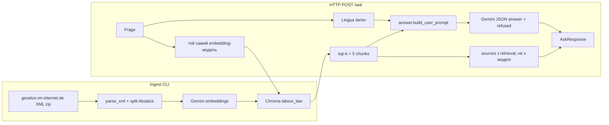
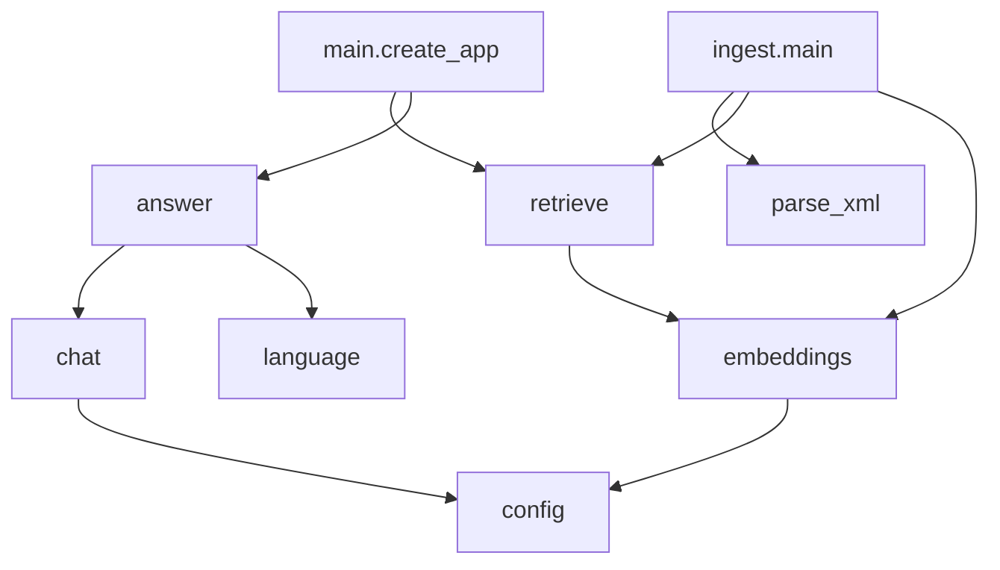

# Структура проєкту та принципові рішення

Цей документ пояснює, **з чого складається** demo RAG-FastAPI, **чому** обрано саме цей стек, і **як модулі взаємодіють**. Це не юридична консультація: відповіді спираються лише на завантажені федеральні закони ФРН про трудове право.

Публічний README німецькою (`README.md`) розрахований на рекрутера. Код, логи, тести й stdout — англійською. Цей файл — внутрішній опис українською.

## Навіщо проєкт існує

Мета — портфоліо-демо для вакансії software engineer (Generative AI): бекенд і API, які **не** пихають увесь корпус у промпт, а дістають кілька релевантних уривків і лише тоді викликають мовну модель.

Обмеження, які формували стек:

- не ускладнювати: один сервіс, одна HTML-сторінка, фіксований корпус;
- Gemini лише з безкоштовної квоти;
- рекрутер, імовірно, **не** запустить додаток — має бути читабельний README і прозора архітектура на GitHub;
- без агентів, LangChain, хмарної векторної БД, логіну й персональних даних.

## Огляд потоків

Два незалежні процеси: **індексація** (рідко, CLI) і **питання** (HTTP).



Ключове правило: **модель не вибирає джерела**. Список `sources` — це п’ять сусідів з Chroma. Модель бачить їхній текст і повертає лише `answer` і `refused`.

## Дерево репозиторію

```
RAG-FastAPI/
├── app/                    # Python-пакет застосунку
│   ├── main.py             # FastAPI: маршрути, фабрика залежностей
│   ├── schemas.py          # Pydantic: AskRequest / AskResponse / Source
│   ├── config.py           # Settings з .env
│   ├── laws.py             # 12 абревіатур і slug для MuSchG
│   ├── ingest.py           # завантаження XML → parse → embed → Chroma
│   ├── parse_xml.py        # XML → Chunk, поділ на Absätze
│   ├── embeddings.py       # протокол + GeminiEmbeddingClient
│   ├── retrieve.py         # PersistentClient, cosine, replace_chunks
│   ├── chat.py             # протокол + GeminiChatClient (JSON schema)
│   ├── answer.py           # system prompt, мова, один retry
│   └── language.py         # Lingua: лише de/en
├── templates/index.html    # одна німецька сторінка + fetch("/ask")
├── tests/                  # pytest без живого Gemini
│   ├── fixtures/           # мінімальний BUrlG-подібний XML
│   └── conftest.py         # KeywordEmbeddingClient, фікстурні chunks
├── scripts/                # живі перевірки квоти / серія запитів
├── docs/
│   ├── struktura-proektu.md          # цей файл
│   ├── experiments/                  # протокол живих запитів
│   └── superpowers/specs|plans/      # початковий дизайн і план
├── Dockerfile, docker-compose.yml
├── pyproject.toml
├── README.md               # німецькою, для GitHub
└── data/indexes/chroma/    # gitignored: локальний індекс
```

Чого немає навмисно: окремого frontend-пакета, `static/` CSS, шару ORM, черги задач, conversation history.

## Як модулі чіпляються один до одного

Залежності спрямовані **всередину**: HTTP і CLI тонкі; бізнес-логіка в чистих функціях; Gemini схований за протоколами.



`create_app(embedding_client, chat_client, chroma_path)` приймає клієнтів ззовні. Тести підставляють `KeywordEmbeddingClient` і `FakeChat` і **не** читають `GEMINI_API_KEY`. `create_default_app()` збирає Gemini-клієнти лише для uvicorn.

### Модулі `app/`

| Файл | Роль |
| --- | --- |
| `config.py` | `GEMINI_API_KEY`, моделі, шлях Chroma. Значення за замовчуванням: embedding `gemini-embedding-001`, chat `gemini-3.5-flash-lite`. |
| `laws.py` | Фіксований список з 12 законів. `MuSchG` качається як `muschg_2018` (інакше 404). |
| `parse_xml.py` | З XML gesetze-im-internet бере `<norm>` з `§`. Нумеровані `(1)(2)…` завжди стають окремими chunks з локатором `BUrlG § 3 Abs. 1`. Занадто довгий абзац ріжеться вікнами 6000/200. |
| `ingest.py` | CLI: zip → XML → chunks → `replace_chunks`. Помилка одного закону зупиняє весь ingest (немає «тихо порожнього» індексу). |
| `embeddings.py` | Один вектор на документ; пауза 0.4 с і retry на HTTP 429 — захист безкоштовної квоти. |
| `retrieve.py` | Колекція `labour_law`, метрика **cosine**. Ingest **видаляє** колекцію й створює заново, щоб не змішувати старі §-chunks з новими Abs.-chunks. |
| `chat.py` | `response_mime_type=application/json` + JSON schema `{answer, refused}`. Відмова — поле моделі, не евристика по німецькому тексту. |
| `language.py` | Lingua лише English+German, офлайн. Неясна мова → `de`. |
| `answer.py` | Промпт: «відповідай лише з уривків». Якщо мова відповіді не збігається з мовою питання — **один** повторний виклик. |
| `main.py` | Валідація довжини питання (1…2000). Порожній індекс → 503. `sources.snippet` до 4000 символів (щоб показати абзац у UI). |
| `schemas.py` | Контракт API: `law`, `paragraph`, `locator`, `title`, `snippet`. |

### HTTP-поверхня

- `GET /` — Jinja віддає `templates/index.html`.
- `GET /health` — процес живий (без перевірки індексу).
- `GET /stats` — `laws`, `chunks`, `characters` з колекції, не з константи в `laws.py`.
- `POST /ask` — retrieval + chat.

HTML навмисно без фреймворка: `fetch`, потім `<details>`/`<summary>` як акордеон джерела. Цитата — `textContent`, не `innerHTML` (закон може містити кутові дужки, XSS не потрібен).

## Чому саме цей стек

Нижче — не «найкращі технології 2026», а відповіді на обмеження демо.

### FastAPI, а не Django / Flask / Node

- Typed JSON через Pydantic збігається з тим, що треба показати рекрутеру: чіткий `POST /ask`.
- Dependency injection через `create_app(...)` дає тести без мережі.
- ASGI + uvicorn — стандартний мінімум для одного сервісу.
- Django тягне ORM і адмінку, яких немає. Flask бідніший на схеми відповідей «з коробки». Node дублював би стек відносно наявного Python-пайплайна ембеддингів.

### Без LangChain / LlamaIndex / агентів

Оркестрація тут — лінійна: embed → kNN → prompt → JSON. Фреймворк додає абстракції, які важко читати на GitHub за 5 хвилин, і маскує, **хто** формує цитування. Відмова від агентів і tool-calling — свідома: модель не повинна ходити в інтернет і «донабирати» факти.

### Chroma локально, а не Pinecone / pgvector / FAISS окремо

- Індекс ~тисяча коротких абзаців: HNSW у процесі достатній.
- Персистентність у каталозі, gitignore, Docker volume `./data/indexes`.
- Немає другого рахунку в хмарі й немає Postgres «для вектора».
- Cosine узгоджується з нормалізованими Gemini-векторами краще, ніж L2 «за замовчуванням», якщо геометрія схожа на сферичну.

Повний федеральний каталог законів **не** індексується: безкоштовні embeddings не витримають обсяг, а демо втратить фокус.

### Gemini для embeddings і chat, не локальна LLM

- Одна квота, один ключ, один вендор у `.env`.
- Chat-модель `gemini-3.5-flash-lite`: дешева/безкоштовна квота; `gemini-2.0-flash` на момент розробки вже був вимкнений (404).
- Embedding `gemini-embedding-001`: той самий API `google-genai`.
- Локальна модель (Ollama тощо) ускладнила б README («спочатку скачай 4 ГБ») і розмила б історію «API + embeddings».

Протоколи `EmbeddingClient` / `ChatClient` лишають шлях замінити вендора без переписування маршрутів.

### Офіційне XML, не PDF і не веб-скрапінг HTML

`gesetze-im-internet.de` віддає структуровані норми: абревіатура, `§`, заголовок, текст. PDF ламає межі абзаців; HTML сторінок нестабільніший за zip з XML. Корпус трудових законів (відпустка, мінзарплата, KSchG…) дає **перевірювані** питання з однозначними цифрами в тексті — зручно для RAG-демо.

### Chunk = абзац закону, не «1000 токенів навмання»

Юридичний текст цитують як `BUrlG § 3 Abs. 1`, а не як «документ №47». Спочатку одиницею був увесь `§`; на практиці `JArbSchG § 19` виявився розмитим, а короткі `BUrlG § 3` — ні. Тому **завжди** ріжемо нумеровані Absätze: retrieval стає точнішим, UI може показати саме той фрагмент, який доводить відповідь.

Вікна 6000 символів — запобіжник для Gemini embedding limits, не основна стратегія нарізки.

### Lingua, не промпт «detect language» і не langdetect

Gemini часто відповідав німецькою на англійське питання. Детектор у промпті ненадійний (модель ігнорує інструкцію). Lingua працює **офлайн**, лише de/en — менше хибних спрацьовувань, ніж всемовний класифікатор. Ціна: сотні мегабайт моделей на диску; для 12 законів це прийнятний компроміс порівняно з другим платним API.

Retry один раз, не цикл: квота.

### Pytest з фейковими embeddings

CI і локальний `pytest` не повинні палити ключ і залежати від мережі. Детерміновані вектори (`KeywordEmbeddingClient`) перевіряють, що питання про відпустку ранжує BUrlG вище за MiLoG. Живі серії записів лежать у `docs/experiments/` і `scripts/run_query_series.py` — окремий, свідомий виклик квоти.

### Docker є, ingest — окремо

Образ піднімає API. Індекс не збирається на кожен `docker compose up`: інакше кожен старт бив би gesetze-im-internet.de і Gemini. Ingest — явна команда на хості або `docker compose run`.

### Одна HTML-сторінка, не React

Рекрутер відкриє GitHub, не SPA. Шаблон показує дисклеймер, JSON-контракт і джерела. Акордеон (`<details>`) — нативна поведінка браузера, без UI-бібліотеки.

## Життєвий цикл одного питання

1. Браузер або клієнт шле `{"question": "…"}`.
2. FastAPI відкидає порожнє / >2000 символів (400).
3. Відкривається Chroma; 0 документів → 503 «Run ingest first».
4. Питання ембедиться **тією ж** моделлю, що й документи під час ingest (інакше kNN безглуздий).
5. Повертаються 5 найближчих chunks **завжди**, без порогу схожості: відсікання «за score» ховало б відповідь у крайових випадках і ускладнювало б пояснення демо.
6. Lingua визначає de/en питання.
7. Chat бачить локатори, заголовки й повний текст уривків; система забороняє вигадувати цифри й цитати.
8. Якщо відповідь іншою мовою — один повтор.
9. HTTP-тіло: `answer`, `refused` з моделі + `sources` з кроку 5.
10. UI малює відповідь і акордеон; відкритий пункт показує `snippet`.

Приклад узгодження: питання про мінімальну відпустку дістає `BUrlG § 3 Abs. 1` з текстом «24 Werktage». Модель може згадати й `JArbSchG § 19 Abs. 2` (юнаки), бо це теж у top-5 — retrieval широкий навмисно.

## Дані, секрети, відтворюваність

| Що | Де |
| --- | --- |
| Ключ Gemini | `.env`, ніколи в git |
| Індекс | `data/indexes/chroma/`, gitignore |
| Версії залежностей | `pyproject.toml` + `uv.lock` |
| Як запустити | німецький README |
| Очікувана поведінка моделі | `docs/experiments/2026-09-18-query-series.md` |

Повторний ingest **обов’язковий** після зміни нарізки (`parse_xml.split_chunks`): вектори прив’язані до старих меж chunk.

## Що свідомо не зроблено (і чому)

| Відкладено | Причина |
| --- | --- |
| Hybrid / BM25 | Спочатку чистий embedding-RAG; окремі промахи retrieval (наприклад NachwG) — тема експерименту, не каркас. |
| Порог відстані | Див. вище: 503 лише якщо індекс порожній; інакше модель має шанс відмовитись через `refused`. |
| Стрімінг токенів | Контракт — один JSON; стрім ускладнює `refused` і UI. |
| Історія діалогу | Кожне питання незалежне; інакше модель «додумує» з попередніх реплік поза корпусом. |
| Повний каталог законів | Квота embeddings і розмитий продукт. |
| Цитування моделлю | Джерела = retrieval, щоб не вигадували неіснуючі параграфи. |

## Як читати код з нуля

1. `docs/superpowers/specs/2026-09-18-rag-labor-law-design.md` — початковий контракт (частина деталей, як-от завжди-Absatz і акордеон, з’явилась пізніше).
2. `app/parse_xml.py` → `app/retrieve.py` → `app/answer.py` → `app/main.py`.
3. `templates/index.html` — єдиний клієнт.
4. `tests/test_ask.py`, `tests/test_parse.py` — поведінка без API-ключа.
5. `README.md` — німецький зовнішній шар.

Разом це вузький RAG: офіційний текст → локальний індекс → п’ять доказових уривків → обмежена мовна модель → відповідь з джерелами, які користувач може розгорнути й прочитати.
